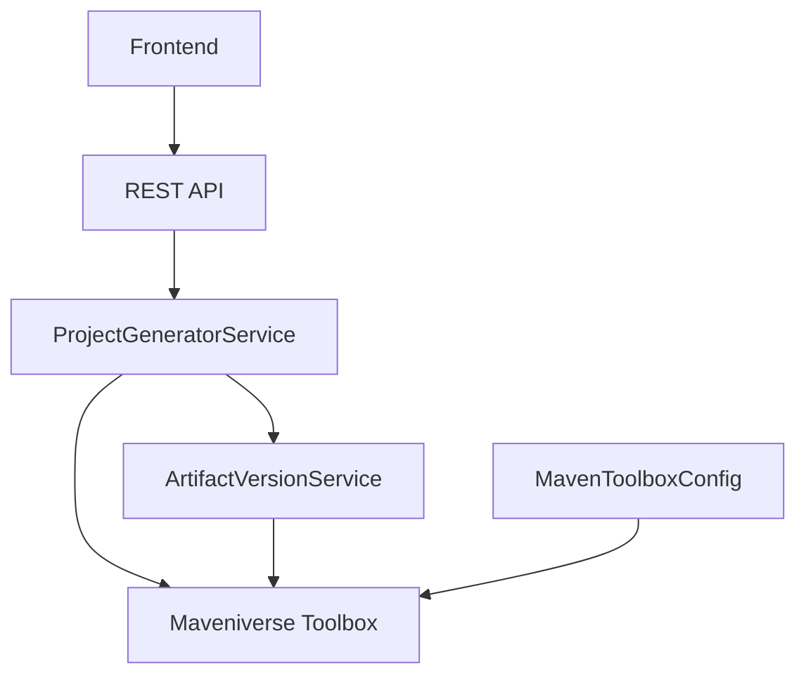
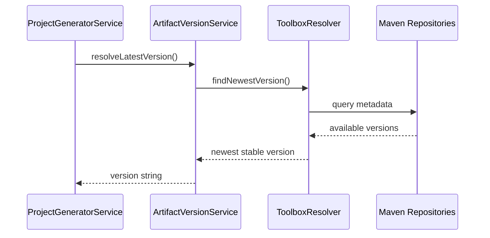
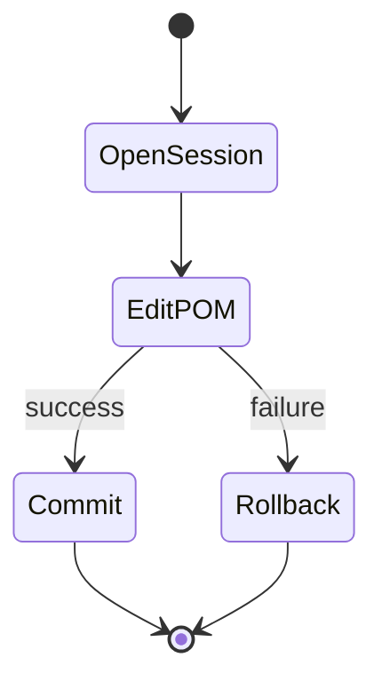

# The Technical Inside of the Maven Initializer: How We Built It with Maveniverse Toolbox

## Introduction

We recently released the first version of the [Maven Initializer](https://github.com/support-and-care/maven-initializer), a modern web application that simplifies the creation of Maven‑based Java projects. Instead of starting from a blank directory or copying boilerplate from older projects, developers can bootstrap a production‑ready setup in seconds—complete with a well‑structured `pom.xml`, sensible defaults, and up‑to‑date dependencies.

**Note:** This is our first release, and development is still ongoing. We're actively working on improvements and new features based on community feedback.

In this post, we take a deep dive into the technical internals of the Maven Initializer. The focus is on **how and why** we built the backend around the **Maveniverse Toolbox**, and how its abstractions allowed us to generate Maven projects programmatically in a way that is safe, readable, and maintainable.

---

## The Core Problem: Programmatic Maven Project Generation

At its heart, the Maven Initializer is a code generator. Given a user request, it must reliably produce a complete Maven project that:

* Contains a valid and well‑formed `pom.xml`
* Declares dependencies and plugins with correct versions
* Configures plugins according to best practices
* Uses current artifact versions from Maven repositories
* Has a clean directory layout (`src/main/java`, `src/test/java`, etc.)
* Can be built immediately with `mvn clean verify`

### Why This Is Hard

Maven configuration lives primarily in XML. Editing XML directly—especially when the structure becomes non‑trivial—tends to be:

* **Error‑prone** (missing elements, wrong nesting)
* **Hard to read** when expressed via DOM APIs
* **Difficult to refactor** as requirements evolve

We needed a solution that would let us *think in terms of Maven concepts*, not XML nodes.

---

## Why Maveniverse Toolbox?

After evaluating several approaches (Archetypes, templating engines, and hand‑rolled XML manipulation), we settled on **Maveniverse Toolbox**.

### Key Reasons

1. **Java DSL instead of XML**
   Toolbox provides a fluent, type‑safe Java DSL for working with POM files. This means we can express intent directly in code, without string concatenation or manual DOM traversal.

2. **Built by Maven maintainers**
   Toolbox is part of the Maveniverse ecosystem and maintained by people who deeply understand Maven internals. That gave us confidence in correctness and long‑term stability.

3. **Clear separation of responsibilities**

   * `PomEditor` for structural POM manipulation
   * `ToolboxCommando` for orchestration and editing sessions
   * `ToolboxResolver` for artifact and version resolution

4. **Reusable outside Maven plugins**
   The Toolbox `shared` module is designed to be embedded in any Java application, which made it a perfect fit for a Spring Boot backend.

---

## High‑Level Architecture

The Maven Initializer follows a clean, layered architecture with a clear separation between UI, orchestration, and Maven‑specific logic.

### Architectural Roles

* **Frontend (Next.js)**: Collects user input and submits a project request
* **Spring Boot Backend**: Orchestrates project generation
* **Maveniverse Toolbox**: Handles all Maven‑specific logic (POM editing, version resolution)

---

## Toolbox Integration in the Backend

### Toolbox Configuration

The integration begins by configuring Toolbox as part of the Spring application context:

* A `Context` abstracts the Maven runtime environment (settings, local repo, mirrors)
* `ToolboxCommando` acts as the main entry point for POM editing and resolution

This setup allows the backend to behave like a lightweight, embedded Maven runtime.

---

## Version Resolution with `ToolboxResolver`

One of the most valuable features we rely on is **automatic version resolution**.

Instead of hard‑coding versions, the backend queries Maven repositories at generation time to determine the newest stable release of a dependency or plugin.

This ensures that generated projects start with modern, non‑snapshot dependencies while still allowing fallbacks when resolution fails.

---

## POM Generation with `EditSession`

### Step 1: Create a Minimal POM

We begin with a minimal, valid POM containing only the essential coordinates:

* `modelVersion`
* `groupId`
* `artifactId`
* `version`

This gives us a stable base that Toolbox can safely extend.

### Step 2: Transactional Editing

All further changes happen inside a **Toolbox `EditSession`**.

This pattern guarantees that:

* Changes are applied atomically
* Partial updates never leak to disk
* A failure leaves the POM in its previous valid state

---

## Fluent DSL for Maven Concepts

The Toolbox DSL allows us to express Maven intent directly:

* Adding properties
* Updating plugins
* Managing dependency management (BOMs)
* Conditionally configuring plugins

Instead of *how* XML is structured, the code describes *what* the project should contain.

This dramatically improves readability and reduces the mental overhead for maintainers.

---

## Plugin Configuration and Extensibility

Configuring plugins—especially executions and goals—is one of the most error‑prone parts of Maven setup. Toolbox simplifies this by letting us:

* Locate plugins by coordinates
* Add executions declaratively
* Attach goals and optional configuration blocks

Because all plugin logic follows the same DSL patterns, adding support for new plugins (for example, Spotless or Checkstyle) becomes incremental rather than invasive.

---

## End‑to‑End Generation Flow

The full lifecycle of a project request looks like this:

Each step is isolated, testable, and built on top of well‑defined abstractions.

---

## Benefits of This Design

### Type Safety

Using constants and DSL methods prevents many classes of errors at compile time.

### Reliability

Transactional editing ensures the POM is always valid or untouched.

### Maintainability

The intent of the code is obvious: future contributors can reason about Maven configuration without being XML experts.

### Extensibility

New options, plugins, and defaults can be added without rewriting existing logic.

---

## Lessons Learned

1. **Good abstractions pay off quickly**
   Toolbox removed an entire category of XML‑related bugs.

2. **Version resolution should not be an afterthought**
   Automatically resolving versions significantly improves project freshness.

3. **Transactional file editing matters**
   Especially when generating artifacts that must always be valid.

4. **DSLs improve long‑term readability**
   Code that reads like intent is easier to maintain than code that mirrors file formats.

---

## Acknowledgments

Special thanks to:

* **The Maveniverse Toolbox team** for building and maintaining a powerful, well‑designed library
* **Sandra Parsick** for early proof‑of‑concept work and ongoing contributions
* **Noah Tayebwa** for driving core development and feature implementation

This project stands on the shoulders of a strong open‑source ecosystem.

---

## Conclusion

The Maven Initializer demonstrates how modern Java tooling can tame complex build‑time concerns. By building on top of Maveniverse Toolbox, we were able to focus on *developer experience* instead of low‑level XML manipulation.

This is our first release, and we're actively developing new features and improvements. We welcome feedback, contributions, and suggestions from the community as we continue to evolve the project.

If you are building tools that interact with Maven programmatically, Maveniverse Toolbox is a foundation well worth exploring.

---

### Resources

* Maven Initializer: [https://github.com/support-and-care/maven-initializer](https://github.com/support-and-care/maven-initializer)
* Maveniverse Toolbox: [https://github.com/maveniverse/maven-toolbox](https://github.com/maveniverse/maven-toolbox)
* Maveniverse MIMA: [https://github.com/maveniverse/mima](https://github.com/maveniverse/mima)
